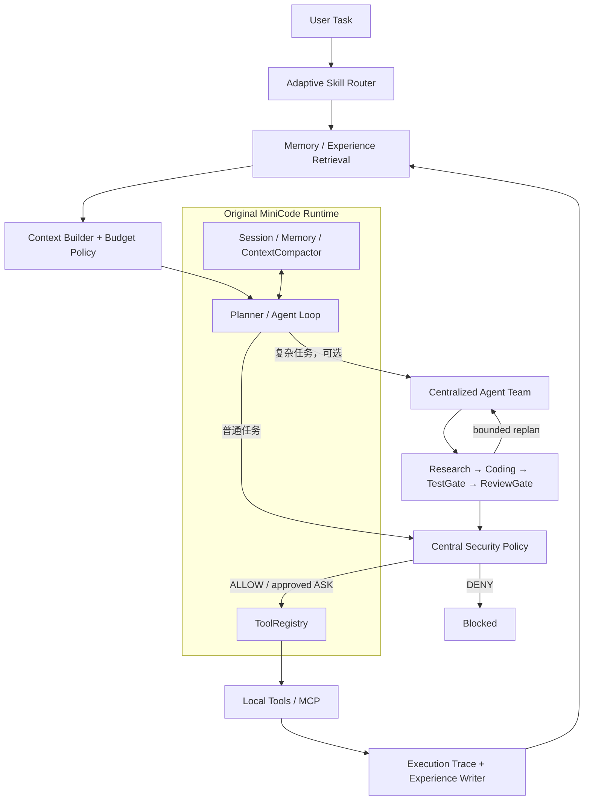

# Adaptive MiniCode

**基于 [MiniCode-Python](https://github.com/QUSETIONS/MiniCode-Python) 二次开发的自适应 Coding Agent Harness。**

Adaptive MiniCode extends the original MiniCode-Python runtime with adaptive skill routing, structured execution experience, layered context budgeting, centralized multi-agent orchestration, and centralized tool security policy.

> **项目状态**：Phase 1–5 已集成 · deterministic final evaluation 已完成 · `LIVE_EVAL_NOT_RUN`
>
> **评测版本**：Original baseline `fd9bf63` · Adaptive runtime `1a07358` · Final integration `97b299c`
>
> **运行要求**：Python 3.11+

## 项目背景

Original MiniCode 已经提供较完整的 Coding Agent Runtime，包括 Agent Loop、Tool Calling、Session、基础 Memory、Reflection、ContextCompactor、Microcompact、ToolResultBudgetManager、单任务 sub-agent、TaskGraph、PermissionManager、AutoMode、workspace confinement、MCP，以及 Hooks / DecisionAuditor。

本 fork 的目标不是从零重写 Coding Agent，也不是把上游能力重新包装为新增功能。Adaptive MiniCode 重点增强运行时之上的 **Harness 层**：在技能选择、执行经验、上下文预算、多智能体调度和工具安全策略之间建立可验证、可恢复的控制路径。

## Original vs Adaptive

| Capability | Original MiniCode | Adaptive MiniCode |
| --- | --- | --- |
| Agent Loop / `run_agent_turn` | SUPPORTED · PRE-EXISTING | SUPPORTED |
| Tool Calling / `ToolRegistry` | SUPPORTED · PRE-EXISTING | SUPPORTED · 接入集中策略检查 |
| Session / basic Memory / Reflection | SUPPORTED · PRE-EXISTING | SUPPORTED · 增加结构化执行经验 |
| `ContextCompactor` / Microcompact | SUPPORTED · PRE-EXISTING | SUPPORTED · 增加分层预算决策 |
| `ToolResultBudgetManager` | SUPPORTED · PRE-EXISTING | SUPPORTED · 与可恢复 artifact 并存 |
| Single task sub-agent / TaskGraph | SUPPORTED · PRE-EXISTING | SUPPORTED |
| `PermissionManager` / AutoMode | SUPPORTED · PRE-EXISTING | SUPPORTED · 增加中央 Security Policy |
| MCP / workspace confinement | SUPPORTED · PRE-EXISTING | SUPPORTED · MCP 增加 pre-execution gate |
| Adaptive Skill Router | UNSUPPORTED | SUPPORTED · ADDED |
| Structured Experience | UNSUPPORTED（原版为非结构化 Memory） | SUPPORTED · ADDED |
| Context Budget Policy | UNSUPPORTED（原版为 reactive compaction） | SUPPORTED · ADDED |
| First-class Recoverable Artifact | PARTIAL · legacy disk persistence only | SUPPORTED · ADDED |
| Centralized Agent Team | UNSUPPORTED（仅 one-off sub-agent） | SUPPORTED · ADDED |
| Central Security Policy Engine | UNSUPPORTED | SUPPORTED · ADDED |
| Tamper-Evident Audit Chain | UNSUPPORTED | SUPPORTED · ADDED |

这里的 `UNSUPPORTED` 只表示对应版本没有同等接口或语义，不表示 Original MiniCode 缺少完整运行能力。

## Architecture

Adaptive Harness 运行在 Original MiniCode Runtime 之上，并复用其 Agent Loop、ToolRegistry、Session、Memory、Context 与 Permission 基础设施。



Security Policy 位于工具实际执行之前。Multi-Agent 是 Agent Loop 可调用的集中式 team 工具，不会替换或劫持父级 turn kernel。

## Phase 1 — Adaptive Skill Routing

- **问题**：全量暴露 skill catalog 会随技能数量线性扩大 prompt，并提高无关技能曝光。
- **设计**：使用 deterministic lexical routing；它不是 semantic search，也不是 vector retrieval。
- **实现**：`SkillRouter` 进行 boundary-aware matching、Top-K exposure 和 metadata routing；`load_skill` 按需加载完整内容，并对路径进行 hardening。
- **验证**：在 100 与 500 skill 的固定 catalog fixture 中保持目标 skill recall，同时显著降低估算曝光 token；无关查询的 Adaptive skill exposure 为 0。

## Phase 2 — Structured Experience Memory

- **问题**：Original MiniCode 已有 Memory，但非结构化文本难以区分成功经验、失败记录和验证状态。
- **设计**：以 outcome 和 verification 为检索约束，而不只做关键词匹配。
- **实现**：`ExperienceRecord`、Execution Trace、verification-aware outcome、failure-specific retrieval、SHA-256 dedup 与 feedback 更新。
- **验证**：固定 fixture 中，普通任务的 failure leakage 从 `0.38` 降至 `0.00`，verified retrieval precision 从 `0.38` 提升至 `0.67`。

## Phase 3 — Context Budget & Recoverable Artifact

- **问题**：Original 已有 `ContextCompactor` 与 `ToolResultBudgetManager`；新增目标是让预算决策更明确，并让被 offload 的上下文成为可寻址、可校验的一级对象。
- **设计**：对上下文项应用 `KEEP / COMPRESS / OFFLOAD / EVICT`，同时保护关键约束和最新验证证据。
- **实现**：`ContextBudgetManager`、stable `ctx_*` artifact IDs、`ContextArtifactStore`、bounded range recovery、`load_context_artifact` 与 source hash 校验。
- **验证**：两版在相同 6000-token budget 下均合规；Adaptive fixture 提供 `1.0` 的 source-hash-verified artifact recovery。

这不是单向 token reduction：在最终固定 fixture 中，Adaptive prepared context 为 `743` estimated tokens，Original 为 `512`，即 Adaptive **更大 45.1%**。增加部分来自结构化 metadata 与 artifact reference，换取可恢复性和证据语义。

## Phase 4 — Multi-Agent Orchestration

- **问题**：Original 已有 one-off task sub-agent，但没有统一协调 Research、Coding、Test 和 Review 的 team runtime。
- **设计**：中央 orchestrator 构建 DAG，允许 read-only sibling concurrency，严格串行化 writer，并以 `TestGate`、`ReviewGate` 和最多一次 bounded replan 判断 team success。
- **实现**：`TeamPlanner`、`TeamScheduler`、role policy、parent-context isolation，以及可选 Worktree isolation。
- **验证**：最终评测通过 deterministic fake subagents 驱动真实 planner、DAG scheduler、并发控制和 quality gates；这不是 live multi-agent model benchmark。

两种执行模式的边界不同：

- **Shared workspace（默认）**：Gate 决定 team 是否成功，但不会自动回滚已经发生的文件修改；它不提供事务语义。
- **Worktree isolation（可选）**：修改先留在临时 worktree。只有 Test PASS、Review APPROVE、parent workspace fingerprint 未变化，并通过 Parent Permission Gate 后，patch 才写回 parent workspace。

## Phase 5 — Security Policy

- **问题**：Original 已有 `PermissionManager` 和 AutoMode；需要在本地工具、MCP 与外部不可信内容之间增加统一的执行前策略。
- **设计**：中央 policy 返回 `ALLOW / ASK / DENY`；对需要授权的 state-changing operations，在缺失有效 `PermissionManager` 时执行 fail-closed。
- **实现**：catastrophic command rules、sensitive-file handling、MCP pre-execution gate、untrusted-content scanning、taint escalation、secret redaction 与 SHA-256 audit hash chain。
- **验证**：固定 security fixture 覆盖关键命令阻断、缺失 permission、敏感信息遮蔽、MCP deny/allow hook 和 tainted mutation escalation。

该层不是 OS sandbox，也不声称覆盖所有攻击。Audit log 是 tamper-evident，不是 immutable storage。

## Evaluation

权威结果位于：

- [`benchmarks/final_evaluation_results.json`](./benchmarks/final_evaluation_results.json)
- [`benchmarks/final_evaluation_results.md`](./benchmarks/final_evaluation_results.md)

评测分别从 baseline `fd9bf63` 和 Adaptive runtime `1a07358` 创建 detached Git worktree，再在独立 Python subprocess 中运行，以避免 `sys.path` 和 module import contamination。所有结果来自 fixed-seed、local deterministic/synthetic fixtures；没有外部网络或在线 LLM 调用，不能解释为 production success rate。

| Category | Metric | Original | Adaptive |
| --- | --- | ---: | ---: |
| Skill · 100 catalog | Estimated exposed tokens | 3378 | 33.0 |
| Skill · 100 catalog | Relevant recall | 1.0 | 1.0 |
| Skill · 100 catalog | Exposure micro precision | 0.0055 | 0.5 |
| Skill · 500 catalog | Estimated exposed tokens | 17303 | 33.1 |
| Experience | Normal failure leakage | 0.38 | 0.00 |
| Experience | Verified retrieval precision | 0.38 | 0.67 |
| Experience | Failure recovery recall | UNSUPPORTED | 1.0 |
| Context | Estimated prepared tokens | 512 | 743（+45.1%） |
| Context | 6000-token budget compliance | PASS | PASS |
| Context | Source-hash-verified artifact recovery | UNSUPPORTED / PARTIAL | 1.0 |
| Security | Critical-action block rate | 0.33 | 1.0 |
| Security | Missing-permission fail-closed scenarios | 0 / 2 | 2 / 2 |
| Security | Sensitive secret leakage | 1.0 | 0.0 |

Multi-agent capability 在 baseline 中为 `UNSUPPORTED`，因此报告为 Adaptive-only capability，而不是用虚构的 baseline 分数计算提升比例。

## Quick Start

### 1. Clone 与安装

```bash
git clone https://github.com/pologggh/MiniCode-Python.git
cd MiniCode-Python
python -m pip install -e .
```

运行评测或测试时安装 dev dependencies：

```bash
python -m pip install -e ".[dev]"
```

### 2. 配置 provider

至少配置一个 provider credential 和一个 model。以下是 Anthropic 的最小示例；仓库也支持 OpenAI、OpenRouter 和自定义 OpenAI-compatible endpoint。

```bash
export ANTHROPIC_API_KEY="your-key"
export ANTHROPIC_MODEL="claude-sonnet-4-20250514"
```

PowerShell：

```powershell
$env:ANTHROPIC_API_KEY = "your-key"
$env:ANTHROPIC_MODEL = "claude-sonnet-4-20250514"
```

也可以通过 `~/.mini-code/settings.json` 配置。`.env.example` 是变量清单；是否由 shell 或容器载入 `.env` 取决于启动方式。提交代码前不要提交真实密钥。

检查配置并启动交互式 CLI：

```bash
minicode-py --validate-config
minicode-py
```

最小交互示例：

```text
分析当前仓库，找出测试入口并说明理由。先读取，不要修改文件。
```

单次 headless 调用：

```bash
minicode-headless "Summarize this repository and identify its test entry points."
```

`minicode-headless --allow-edits` 会自动批准本次运行的 edits、commands 和 out-of-cwd access，只应对受信任任务显式开启。

Docker CLI 入口也由仓库提供：

```bash
docker compose run --rm -e ANTHROPIC_API_KEY="your-key" cli
```

## Usage Examples

### 普通 coding task

```bash
minicode-headless --allow-edits "修复指定测试失败；先定位根因，只修改必要文件，最后运行相关测试。"
```

### 复杂 multi-agent task

在 `minicode-py` 交互界面中提交自然语言任务；运行时可选择真实存在的 `agent_team` tool：

```text
使用协调团队分析这个跨模块问题：先并行研究实现与测试，再串行修改，最后通过 TestGate 和 ReviewGate。
```

`agent_team` 的真实输入包括 `goal`、可选 `use_worktree` 和 `max_replans`；当前没有对应的独立 CLI flag。

### Security-sensitive task

```bash
minicode-headless "检查项目的凭据读取路径和 MCP 配置。不得输出秘密值，不执行修改或外部命令。"
```

安全策略仍可能对操作返回 `ASK` 或 `DENY`；不要把自然语言约束当作 OS-level containment。

## Repository Structure

```text
minicode/
├── agent_loop.py                 # Original runtime loop + Adaptive integration points
├── skill_router.py               # Phase 1 lexical routing
├── experience.py                 # Phase 2 structured experience records
├── execution_trace.py            # Phase 2 execution evidence
├── context_budget.py             # Phase 3 KEEP/COMPRESS/OFFLOAD/EVICT policy
├── context_artifacts.py          # Phase 3 recoverable artifact store
├── team_planner.py               # Phase 4 team DAG planning
├── team_scheduler.py             # Phase 4 scheduling, gates, bounded replan
├── team_roles.py                 # Phase 4 role policy
├── security_policy.py            # Phase 5 central decision engine
├── security_rules.py             # Phase 5 policy rules
├── security_audit.py             # Phase 5 hash-chained audit
├── untrusted_content.py          # Phase 5 taint handling
└── tools/                        # ToolRegistry tools, including agent_team/load_* tools

benchmarks/
├── final_evaluation.py           # Cross-version orchestrator
├── final_eval/                   # Isolated fixtures, workers, metrics
└── final_evaluation_results.*    # Authoritative deterministic results

tests/                            # Runtime, phase-specific and final-evaluation tests
```

## Evaluation Reproduction

在包含 `fd9bf63` 与 `1a07358` 的完整 Git clone 中运行：

```bash
python -m pip install -e ".[dev]"
pytest tests/test_final_evaluation.py -v
python benchmarks/final_evaluation.py
```

第二条命令验证 final-evaluation harness；第三条命令重新创建 detached worktrees、运行隔离 subprocess，并更新默认 evaluation result artifacts。不要在有未保存结果时盲目覆盖这些文件。

Live model evaluation 未运行：

```text
LIVE_EVAL_NOT_RUN
```

因此本项目不声称已完成真实 provider、真实模型或线上 coding workload benchmark。

## Limitations

- Deterministic fixtures are not production workloads。
- Token counts 是本地估算值（约 4 characters/token），不是 provider tokenizer 或计费 token。
- 没有运行 live provider/model evaluation。
- Multi-agent evaluation 使用 deterministic fake subagents 驱动真实 scheduler，不代表真实模型协作质量。
- Worktree isolation 是可选模式，不是默认强制隔离。
- Shared-workspace 下 gate failure 不提供 transactional rollback，已发生的修改可能保留。
- Security Policy 不是 OS sandbox，也不保证覆盖未知攻击或全部绕过方式。
- Audit 是 tamper-evident，不是 immutable。
- 没有 external anchor 时，audit chain 不能独立检测整份日志删除或 tail truncation。
- Windows 环境创建 symlink 可能需要额外权限，因此相关 symlink tests 可能被 skip。

## Upstream & Attribution

本项目 fork 自 [QUSETIONS/MiniCode-Python](https://github.com/QUSETIONS/MiniCode-Python)，当前二次开发仓库为 [pologggh/MiniCode-Python](https://github.com/pologggh/MiniCode-Python)。

Original runtime capabilities——包括 Agent Loop、Tool Calling、Session、基础 Memory、Reflection、ContextCompactor、Microcompact、ToolResultBudgetManager、single task sub-agent、TaskGraph、PermissionManager、AutoMode、workspace confinement、MCP 与 Hooks / DecisionAuditor——仍属于 upstream work。

本 fork 实现的 Adaptive Harness 改进范围是 Phase 1–5：Adaptive Skill Routing、Structured Experience Memory、Context Budget Policy 与 Recoverable Artifact、Centralized Multi-Agent Orchestration，以及 Central Security Policy Engine。任何对本项目的介绍都不应把完整 MiniCode Runtime 描述为本 fork 从零原创。
